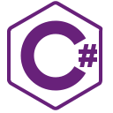

<h1 align="center">hello (｡☉ω ⊙｡) i am danré</h1>
- 🔭 currently working on side projects

- 🌱 i’m currently learning **groovy (●´ω ｀ ●)**

- 💬 ask me about **operating  systems/configs (◕ܫ◕)**

<h3 align="left">Connect with me:</h3>

<h3 align="left">Languages and Tools:</h3>

 

